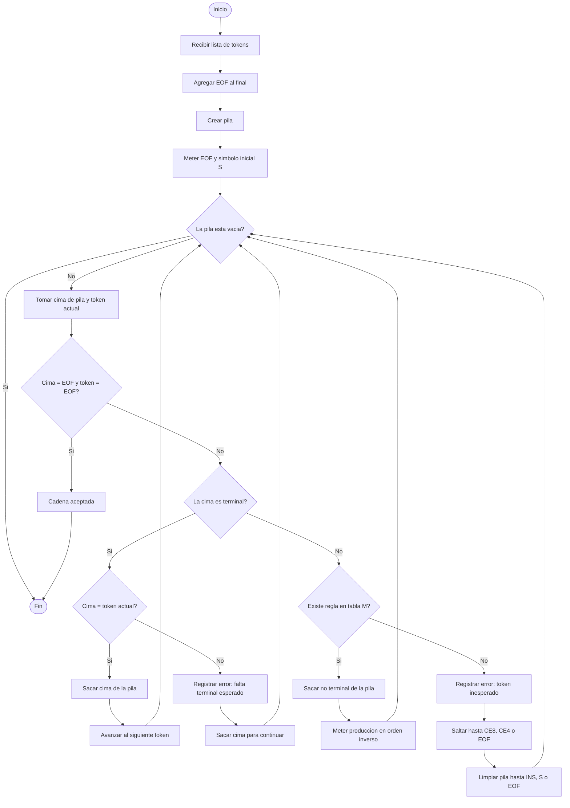

1. Declaraciones
~~~
INI {
    ENT vEdad = 20;
    DEC vPrecio = 19.99;
    TXT vMensaje = "Hola mundo";
    BOOL vActivo = VDD;
    CAR vLetra = 'A';
}
~~~
2. Asignaciones y expresiones
~~~
INI {
    ENT vX = 5;
    ENT vY = 10;
    ENT vResultado;

    vResultado = vX + vY * 2;
    vResultado = (vX + vY) * 3;
    vResultado = 2 ^ 3;
}
~~~
3. LEER e IMP
~~~
INI {
    TXT vNombre;

    vNombre = LEER();
    IMP("Hola usuario");
    IMP(vNombre);
}
~~~
4. SI / SINO
~~~
INI {
    ENT vEdad = 18;

    SI (vEdad >= 18) {
        IMP("Mayor de edad");
    }
    SINO {
        IMP("Menor de edad");
    }
}
~~~
5. Condiciones lógicas
~~~
INI {
    ENT vA = 10;
    ENT vB = 5;
    BOOL vBandera = VDD;

    SI ((vA > vB) & (vBandera == VDD)) {
        IMP("Condicion verdadera");
    }

    SI (!(vA < vB) | (vBandera == VDD)) {
        IMP("Otra condicion verdadera");
    }
}
~~~
6. ENCASO / DFCT
~~~
INI {
    ENT vOpcion = 2;

    ENCASO (vOpcion) {
        1: IMP("Elegiste uno"); ROMPER;
        2: IMP("Elegiste dos"); ROMPER;
        DFCT: IMP("Opcion invalida"); ROMPER;
    }
}
~~~
7. MIENT
~~~
INI {
    ENT vContador = 0;

    MIENT (vContador < 5) {
        IMP(vContador);
        vContador = vContador + 1;
    }
}
~~~
8. REPT / HASTA
~~~
INI {
    ENT vNum = 0;

    REPT {
        vNum = vNum + 1;
        IMP(vNum);
    } HASTA (vNum == 5);
}
~~~
9. POR
~~~
INI {
    ENT vTotal = 0;

    POR (ENT vI = 1; vI <= 10; vI = vI + 1) {
        vTotal = vTotal + vI;
        IMP(vTotal);
    }
}
~~~
10. Gráficas / consola
~~~
INI {
    LIMP();
    FONCOL("FFFFFF");
    TXTCOL("000000");
    SLTLN(2);
    POS(40,5);
    TECL();
    IMPREP("=",10);
}
~~~
11. INTER
~~~
INI {
    ENT vUno = 5;
    ENT vDos = 7;

    INTER(ENT,vUno,vDos);
}
~~~
12. Función y llamada
~~~
INI {
    FUNC ENT fSumar(ENT vA,ENT vB) {
        ENT vResultado = vA + vB;
        REGR vResultado;
    }

    ENT vTotal;
    vTotal = fSumar(5,10);
    IMP(vTotal);
}
~~~

## Funcionamiento analizador sintactico

# Diagrama de flujo del analizador sintactico LL(1)

Este diagrama representa el metodo principal del analizador sintactico descendente predictivo LL(1).

## Explicacion para la profe

1. El analizador recibe una cadena de tokens.
2. Agrega `EOF` para saber donde termina la entrada.
3. Inicia la pila con `EOF` y el simbolo inicial `S`.
4. Mientras la pila no este vacia, compara la cima de la pila con el token actual.
5. Si la cima es terminal y coincide, hace `match`.
6. Si la cima es no terminal, busca una produccion en la tabla M.
7. Si encuentra regla, expande la produccion en la pila.
8. Si no encuentra regla, registra error y se recupera saltando a un punto seguro.

La cadena se acepta si al final la pila queda en `EOF` y el token actual tambien es `EOF`.

