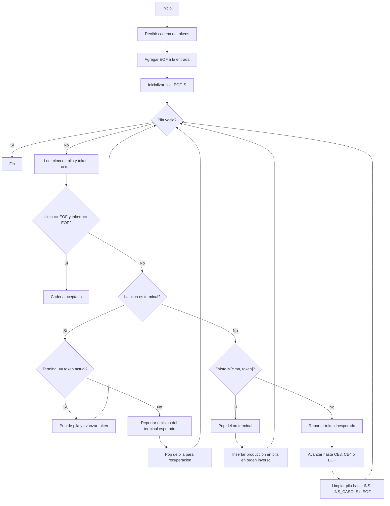

# Analizador sintactico LL(1) para COND

Este documento resume la logica que se puede pasar a PDF para la evidencia del analizador sintactico de condiciones de GatoSabe.

## Tipo de analizador

Analizador sintactico descendente predictivo LL(1), tambien conocido como top-down LL(1).

Entrada:
- Gramatica de condicion.
- Cadena de tokens, por ejemplo: `IDV OPR3 CNU OPL1 IDV OPR6 PR20 EOF`.

Salida:
- Acepta la cadena si la pila y la entrada llegan juntas a `EOF`.
- Reporta error sintactico si no existe produccion en la tabla M o si el terminal esperado no coincide.

## Gramatica usada para condiciones

```txt
COND       -> COND_OR
COND_OR    -> COND_AND COND_OR_P
COND_OR_P  -> OPL2 COND_AND COND_OR_P | e
COND_AND   -> COND_NOT COND_AND_P
COND_AND_P -> OPL1 COND_NOT COND_AND_P | e
COND_NOT   -> OPL3 COND_NOT | COND_REL
COND_REL   -> EXP REL_OPC | CE1 COND CE2
REL_OPC    -> OPR1 EXP | OPR2 EXP | OPR3 EXP | OPR4 EXP | OPR5 EXP | OPR6 EXP | e
```

La condicion usa `EXP`, por eso el modulo de condicion tambien necesita la gramatica de expresiones.

```txt
EXP    -> TERM EXP_P
EXP_P  -> OPA+ TERM EXP_P | OPA- TERM EXP_P | e
TERM   -> POT TERM_P
TERM_P -> OPA* POT TERM_P | OPA/ POT TERM_P | e
POT    -> VALOR POT_P
POT_P  -> OPA^ POT | e
VALOR  -> IDV | CNU | CAD | CAR | PR20 | PR21 | PR22 | CALL_FUNC | CE1 EXP CE2
```

## Diagrama de flujo



## Ejemplo de recorrido

Condicion:

```gatosabe
vEdad >= 18 & vActivo == VDD
```

Tokens:

```txt
IDV OPR3 CNU OPL1 IDV OPR6 PR20 EOF
```

Resumen:
1. `S` deriva a `COND`.
2. `COND` deriva a `COND_OR`.
3. La primera comparacion `IDV OPR3 CNU` se reconoce como `EXP REL_OPC`.
4. `OPL1` activa `COND_AND_P`.
5. La segunda comparacion `IDV OPR6 PR20` se reconoce igual.
6. Al llegar a `EOF`, la pila tambien queda en `EOF`, por lo tanto se acepta.
