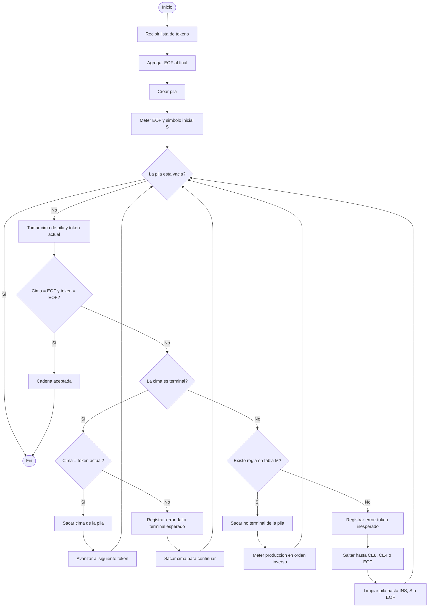

# Diagrama de flujo del analizador sintactico LL(1)

Este diagrama representa el metodo principal del analizador sintactico descendente predictivo LL(1).

Nota: si lo pegas en Mermaid Live Editor, pega solo el contenido de adentro del bloque, sin las lineas ```mermaid y ```.



## Explicacion corta

1. El analizador recibe una cadena de tokens.
2. Agrega `EOF` para saber donde termina la entrada.
3. Inicia la pila con `EOF` y el simbolo inicial `S`.
4. Mientras la pila no este vacia, compara la cima de la pila con el token actual.
5. Si la cima es terminal y coincide, hace `match`.
6. Si la cima es no terminal, busca una produccion en la tabla M.
7. Si encuentra regla, expande la produccion en la pila.
8. Si no encuentra regla, registra error y se recupera saltando a un punto seguro.

## Ejemplo de condicion

Condicion:

```gatosabe
vEdad >= 18 & vActivo == VDD
```

Tokens:

```txt
IDV OPR3 CNU OPL1 IDV OPR6 PR20 EOF
```

La cadena se acepta si al final la pila queda en `EOF` y el token actual tambien es `EOF`.
